# Índice

- [1.Infraestructura del Centro de Procesamiento de Datos (CPD)](#1infraestructura-del-centro-de-procesamiento-de-datos-cpd)
  - [1.1 Diseño Arquitectónico y Ubicación Física](#11-diseo-arquitectnico-y-ubicacin-fsica)
    - [1.1.1.	Ubicación de la Sala y Justificación](#111-ubicacin-de-la-sala-y-justificacin)
    - [1.1.2.Medidas de Ocultación de la Infraestructura](#112medidas-de-ocultacin-de-la-infraestructura)
    - [1.1.3.	Sistema de Climatización, Rangos Ambientales y Calidad del Aire](#113-sistema-de-climatizacin-rangos-ambientales-y-calidad-del-aire)
    - [1.1.4.	Especificaciones del Suelo y Techo Técnico](#114-especificaciones-del-suelo-y-techo-tcnico)
    - [1.1.5.	Planos de Planta y Distribución de la Sala](#115-planos-de-planta-y-distribucin-de-la-sala)
  - [1.2 Infraestructura IT y Distribución de Racks](#12-infraestructura-it-y-distribucin-de-racks)
    - [1.2.1. Inventario de Hardware Físico (Servidores, Switches y Patch Panels)](#121-inventario-de-hardware-fsico-servidores-switches-y-patch-panels)
    - [1.2.2. Distribución Espacial de los Racks (Estructuración)](#122-distribucin-espacial-de-los-racks-estructuracin)
    - [1.2.3. Gestión del Cableado Estructurado](#123-gestin-del-cableado-estructurado)
    - [1.2.4. Diagramas de Alzado de los Racks](#124-diagramas-de-alzado-de-los-racks)
  - [1.3 Infraestructura Eléctrica y Continuidad de Negocio](#13-infraestructura-elctrica-y-continuidad-de-negocio)
    - [1.3.1. Diseño de la Alimentación Redundante](#131-diseo-de-la-alimentacin-redundante)
    - [1.3.2. Memoria de Cálculo de la Carga en Vatios (W) y Voltiamperios (VA)](#132-memoria-de-clculo-de-la-carga-en-vatios-w-y-voltiamperios-va)
    - [1.3.3. Dimensionamiento del Sistema de Alimentación Ininterrumpida (SAI)](#133-dimensionamiento-del-sistema-de-alimentacin-ininterrumpida-sai)
    - [1.3.4. Justificación del Tiempo de Autonomía de las Baterías](#134-justificacin-del-tiempo-de-autonoma-de-las-bateras)
  - [1.4 Seguridad y Prevención de Riesgos Laborales](#14-seguridad-y-prevencin-de-riesgos-laborales)
    - [1. Seguridad Física](#1-seguridad-fsica)
    - [2. Seguridad Lógica](#2-seguridad-lgica)
    - [3. Medidas de prevención de riesgos laborales](#3-medidas-de-prevencin-de-riesgos-laborales)
  - [Nube 2. Despliegue de la Infraestructura Lógica en el Núvol (AWS)](#nube-2-despliegue-de-la-infraestructura-lgica-en-el-nvol-aws)
    - [2.1 Arquitectura de Red Virtual (VPC) y Seguridad Lógica](#21-arquitectura-de-red-virtual-vpc-y-seguridad-lgica)
    - [2.2 Implementación de Servicios en Instancias EC2](#22-implementacin-de-servicios-en-instancias-ec2)
    - [2.3 Automatización, Accesos y Gestión de Configuración](#23-automatizacin-accesos-y-gestin-de-configuracin)
  - [3. Implantación de Servicios Multimedia y Redes](#3-implantacin-de-servicios-multimedia-y-redes)
    - [3.1. Servicio de Distribución de Audio Streaming](#31-servicio-de-distribucin-de-audio-streaming)
    - [3.2. Servicio de Vídeo Streaming y Videoconferencia](#32-servicio-de-vdeo-streaming-y-videoconferencia)
    - [3.3. Pruebas Transversales de Rendimiento y Ancho de Banda](#33-pruebas-transversales-de-rendimiento-y-ancho-de-banda)
- [4. Diseño y Administración de la Base de Datos](#4-diseo-y-administracin-de-la-base-de-datos)
  - [4.1 Diseño de la base de datos](#41-diseo-de-la-base-de-datos)
    - [1. Diseño diagrama Entidad-Relación](#1-diseo-diagrama-entidad-relacin)
    - [2. Diseño del modelo relacional](#2-diseo-del-modelo-relacional)
  - [4.2 Implementación de la base de datos](#42-implementacin-de-la-base-de-datos)
    - [1. Elección del SGBD](#1-eleccin-del-sgbd)
    - [2. Creación de la BBDD](#2-creacin-de-la-bbdd)
  - [4.3 Gestión de usuarios, roles y permisos](#43-gestin-de-usuarios-roles-y-permisos)
    - [1. Definición de roles](#1-definicin-de-roles)
    - [2. Script para automatizar la creación de usuarios](#2-script-para-automatizar-la-creacin-de-usuarios)
  - [4.4 Triggers para control de accesos y Auditoría](#44-triggers-para-control-de-accesos-y-auditora)
    - [1. Control de cuotas de los usuarios](#1-control-de-cuotas-de-los-usuarios)
    - [2. Tabla de avisos y auditoría](#2-tabla-de-avisos-y-auditora)
    - [3. Gestión de bloqueo de usuarios](#3-gestin-de-bloqueo-de-usuarios)
  - [4.5 Eventos periódicos - Backup](#45-eventos-peridicos---backup)
- [5. Sostenibilidad, Gestión del Cambio y Transformación Digital](#5-sostenibilidad-gestin-del-cambio-y-transformacin-digital)
  - [5.1. Evaluación del Impacto de Seguridad e Importancia de las Datos](#51-evaluacin-del-impacto-de-seguridad-e-importancia-de-las-datos)
  - [5.2. Optimización Tecnológica y Transformación Digital](#52-optimizacin-tecnolgica-y-transformacin-digital)
  - [6. Entregables Multimedia e Incidencias](#6-entregables-multimedia-e-incidencias)

---

 Projecte Transversal

- Nombre del proyecto: pro-asixc1c-g3
- Miembros del grupo: Lucia Isabel Bartolomé, Eduardo Perales, Pol Guerrero, Aleshka Cisneros.
- Centro: Institut Tecnològic de Barcelona (ITB)
- Curso: 2025/2026

## 

## 

## 

## 

## 

## 

## 

## 

## 

## 

## 

## 

## 

## 

## 

## 

## 

## 

## 

# 1.Infraestructura del Centro de Procesamiento de Datos (CPD)

## 1.1 Diseño Arquitectónico y Ubicación Física

### 1.1.1.	Ubicación de la Sala y Justificación

El CPD para Innovate Tech se encontraría en una planta intermedia del edificio. 

En un edificio como el mostrado en el dibujo, una localización ideal sería la primera planta en un edificio de 3 plantas, planta baja y sótano.

Un sótano podría parecer más seguro pues está rodeado de tierra y la entrada es más complicada para terceros. Sin embargo, puede tener más peligro debido a inundaciones y la humedad puede ser más difícil de controlar.

Además, el acceso de fibra puede ser más complicado.

La planta baja conlleva un riesgo de acceso no autorizado, pues es donde se encuentra la entrada general y es demasiado accesible al público.

Las plantas altas tampoco son recomendables, puesto que son más susceptibles al calor solar o a las lluvias, además que en caso de evacuación pueden ser difíciles de controlar. Otro problema sería la instalación o modificación de equipos, pues toda la maquinaria usada ha de transportarse y tiene un peso considerable, por lo que las plantas altas supondría otro problema. 

La primera planta es la ideal, pues se encuentra a cierta altura sobre el suelo, eliminando el riesgo de inundación. También facilita la entrada de los cables y no está accesible directamente desde la calle al público.

### 

### 1.1.2.Medidas de Ocultación de la Infraestructura

La sala en la que se instala no tendrá carteles externos que indiquen el contenido del interior de manera explícita para así mantener en secreto su ubicación. En cambio, podemos indicar que se trata de una simple sala de mantenimiento, la cual estará bajo llave. Además, la estancia no debe tener ventanas en la fachada, pues puede resultar en una entrada no autorizada o en problemas con la climatización.

### 1.1.3.	Sistema de Climatización, Rangos Ambientales y Calidad del Aire

Respecto a la climatización, nuestro centro de datos tiene un sistema de refrigeración eficiente que acelera y mantiene la correcta ventilación de los equipos. Este consiste de un CRAC ubicado en un lateral de la sala con un filtro de aire HEPA implementado en su interior. Estos dispositivos trabajan conjuntamente para limpiar el aire de las partículas de polvo y así poder enfriarlo.

Los racks de la sala están colocados de manera estratégica, pues conseguimos formar un sistema de pasillo cerrado frío y pasillo caliente. 

Además, mantenemos una temperatura ambiente estable de entre 18ºC y 27ºC y una humedad relativa de entre el 40% y el 60%.

### 1.1.4.	Especificaciones del Suelo y Techo Técnico

El suelo y techo técnico tendrán unos 50-60 cm de altura, suficiente para transportar el aire caliente y frío, además de los distintos cableados. 

Por nuestro suelo técnico encontramos los cables de alimentación, que proporcionarán electricidad a nuestros equipos y dispositivos para funcionar correctamente.

Por nuestro techo técnico, en cambio, encontraremos el cableado de datos. 

Esta separación de cableado cumple con la norma de separar alimentación y datos, pues los cables de electricidad pueden causar interferencias a la transmisión de datos. Esta separación física permite asegurar que no ocurra.

Además, puesto que nuestros cables de transmisión de datos irán por el techo falso, conducto por dónde pasará el aire caliente, es muy recomendable que estén colocados dentro de una bandeja metálica cerrada con tapa, la cual actuaría como barrera térmica. Es aún más recomendable utilizar fibra óptica, mucho más resistente al calor.

### 1.1.5.	Planos de Planta y Distribución de la Sala

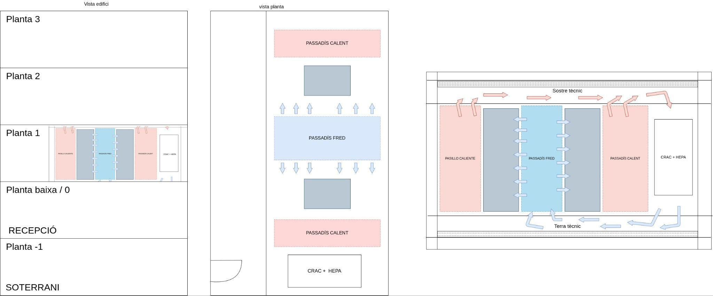

## 1.2 Infraestructura IT y Distribución de Racks

### 1.2.1. Inventario de Hardware Físico (Servidores, Switches y Patch Panels)

Para montar la infraestructura de Innovate Tech, la idea clave es no cometer el error típico de comprar un servidor físico para cada servicio. Eso sería carísimo, poco eficiente y tiraría por tierra la sostenibilidad del proyecto. En su lugar, vamos a usar virtualización, consolidamos todo en solo dos servidores físicos potentes y un almacenamiento centralizado para ahorrar energía y optimizar recursos.

Este es el hardware real que vamos a meter en el CPD:

- 2x Servidores Host (Dell PowerEdge R760 - 2U cada uno): 
Son las dos máquinas principales donde irá el hipervisor para crear las máquinas virtuales. Llevan fuentes redundantes con certificación Titanium para no gastar luz de más (sostenibilidad) y tarjetas de red dobles a 10 Gbps para que no haya cuellos de botella.
- 1x Cabina de Almacenamiento Centralizado (QNAP Enterprise ZFS NAS ES1642dc - 3U): 
Aquí es donde guardaremos todos los datos de la empresa de forma centralizada. Elegimos este modelo porque tiene doble controladora activa (si una placa madre se quema, la otra sigue funcionando sin cortes). Además, usa el sistema de archivos ZFS y un entorno RAID 6, lo que significa que aunque se rompan dos discos a la vez, no perdemos ni un solo vídeo, audio o dato de la base de datos.
- 2x Switches de Red (Cisco Catalyst 9300 - 1U cada uno): 
Se encargan de conectar todo. Los configuramos en modo *Stack* (apilados físicamente). Así, la red los ve como un único switch gigante; si uno se apaga o falla, el otro absorbe todo el tráfico al instante para que la empresa no se quede colgada.
- 2x Patch Panels Cat6A (24 puertos - 1U cada uno): 
Sirven para organizar el cableado que viene de fuera del rack antes de conectarlo a los switches Cisco, protegiendo los puertos de estos últimos contra el desgaste de conectar y desconectar. Soporta velocidades de hasta 10 Gbps, algo fundamental para que las pruebas de ancho de banda salgan perfectas.

### 1.2.2. Distribución Espacial de los Racks (Estructuración)

El CPD va a tener 2 armarios Rack de 42U de altura. Los separamos de esta forma para organizar bien los flujos de aire (pasillo frío/caliente) y evitar que si falla algo, caiga toda la infraestructura a la vez:

Rack 1: Servicios de Producción e Infraestructura Base

Este armario se enfoca en las herramientas de gestión interna de la empresa.

- Hardware: Aquí dentro va el Host 1 (Dell R760), un patch panel y el primer switch Cisco.
- Parte Virtual: Dentro del Host 1 creamos tres Máquinas Virtuales (VMs) independientes:
  - VM-01 (Servidor Web + SFTP Seguro): La web y la subida de archivos segura, que además se comunica con el directorio activo para los usuarios.
  - VM-02 (Directorio Activo / LDAP): Donde guardamos las cuentas y permisos de todos los empleados.
  - VM-03 (Servidor de Logs Centralizado): La máquina encargada de recoger los eventos y logs de seguridad de todo el CPD para tenerlo todo auditado.

Rack 2: Servicios Multimedia, Almacenamiento y Alta Disponibilidad

Este armario se encarga de la parte pesada: streaming, videollamadas y la persistencia de datos.

- Hardware: Contiene el Host 2 (Dell R760), la cabina de almacenamiento QNAP NAS y el segundo switch Cisco. 
- Parte Virtual: El Host 2 moverá estas cuatro VMs dedicadas al entorno multimedia:
  - VM-04 (Base de Datos Relacional): El motor de la base de datos con toda la información de empleados, llamadas y medidas de red.
  - VM-05 (Streaming de Audio): El servidor para la distribución de los canales de audio (MP3/AAC/OGG).
  - VM-06 (Streaming de Vídeo): El servidor (Nginx/Jellyfin) para transmitir los vídeos en formato MP4/H.264.
  - VM-07 (Videoconferencia Jitsi Meet): La plataforma para las videollamadas internas en tiempo real con WebRTC.

Cómo funciona la Alta Disponibilidad (HA): Al tener el almacenamiento en la cabina QNAP compartida entre los dos servidores, si el Host 1 se rompe o se apaga por mantenimiento, el Host 2 se da cuenta al instante y arranca las VMs del compañero de forma automática. Así, Innovate Tech nunca se queda sin servicio.

### 1.2.3. Gestión del Cableado Estructurado

Para que la red vaya bien y las pruebas de velocidad (download, upload y latencia) den el máximo rendimiento, los cables se organizan con una separación física total: 

1. Cables de Datos (Por el Techo): Todo el cableado estructurado Cat6A y la fibra óptica van por bandejas metálicas suspendidas en el falso techo (techo técnico). De ahí bajan por detrás de los racks directos a los Patch Panels.
1. Cables de Corriente (Por el Suelo): Los cables de electricidad que alimentan las fuentes redundantes van por debajo de las baldosas, por el suelo técnico, directos a las regletas (PDUs).

¿Por qué hacemos esto? (Evitar la EMI)

Los cables eléctricos normales generan campos magnéticos a su alrededor. Si juntas un cable de datos con uno de luz, esa electricidad mete "ruido" e interferencias electromagnéticas (EMI) en la red. Esto provoca que se pierdan paquetes, que internet vaya lento y que el streaming o las llamadas de Jitsi sufran cortes.  

Al tirar los datos por el techo y la luz por el suelo, eliminamos las interferencias al 100%, asegurando que la red sea ultra estable.

### 1.2.4. Diagramas de Alzado de los Racks

Este esquema muestra cómo colocamos físicamente los equipos de arriba a abajo dentro de las 42U del armario:

- Lo pesado va abajo (Seguridad y PRL): El NAS QNAP y los servidores Dell son los equipos que más pesan. Al ponerlos abajo del todo (U1 a U5), el centro de gravedad del armario se mantiene bajo. Así evitamos que el rack pueda volcarse si hay un golpe, cumpliendo las normas de Prevención de Riesgos Laborales. Además, reciben primero el aire frío que entra por el suelo técnico.
- Las comunicaciones en medio: Los switches y patch panels van en las posiciones U20 y U21. Se colocan ahí por comodidad: quedan a la altura de los ojos, lo que facilita a los técnicos conectar y etiquetar cables sin tener que tirarse al suelo. 
- Esquema del Alzado de los Racks:

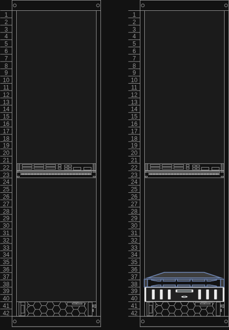

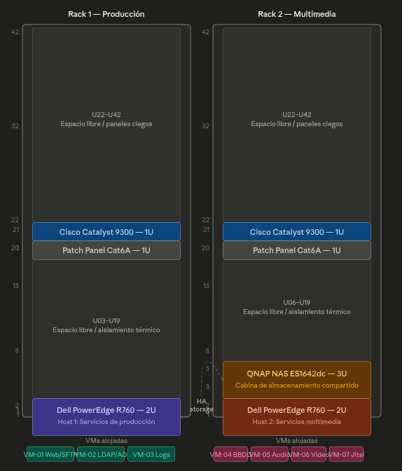

## 1.3 Infraestructura Eléctrica y Continuidad de Negocio

### 1.3.1. Diseño de la Alimentación Redundante

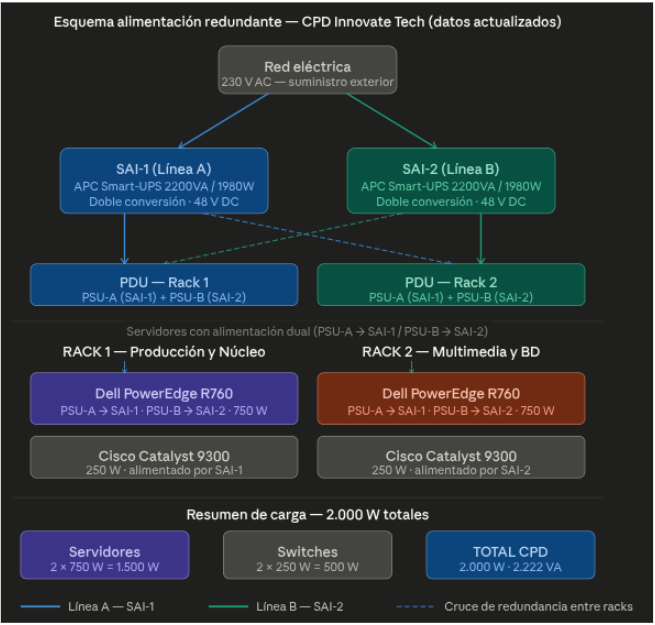

### 1.3.2. Memoria de Cálculo de la Carga en Vatios (W) y Voltiamperios (VA)

| Dispositivo | Cantidad | Consumo unitario | Subtotal |
| --- | --- | --- | --- |
| Dell PowerEdge R760 (Rack 1) | 1 | 750 W | 750 W |
| Dell PowerEdge R760 (Rack 2) | 1 | 750 W | 750 W |
| Cisco Catalyst 9300(×2 racks) | 2 | 250 W | 500 W |
| TOTAL | xxxxxxxxx | xxxxxxxxxx | 2000 W |

### 1.3.3. Dimensionamiento del Sistema de Alimentación Ininterrumpida (SAI)

VA = W / FP = 2.000 W / 0,9 = 2.222 VA

Se seleccionan dos SAIs de 2.200 VA / 1.980 W en doble conversión online, uno por línea. Cada SAI puede sostener solo la carga completa, por lo que si uno falla, el otro absorbe todo sin problema.

Modelo recomendado: APC Smart-UPS Online SRT 2200VA RM (SRT2200RMXLI) doble conversión, baterías hot-swap, gestión SNMP, banco de baterías 48 V DC.

### 1.3.4. Justificación del Tiempo de Autonomía de las Baterías

Tiempo objetivo: 30 minutos — suficiente para arranque del grupo electrógeno y graceful shutdown ordenado de bases de datos y servicios.

Ah = (W × t) / (V_bat × η)

   = (2.000 × 0,5) / (48 × 0,95)

   = 1.000 / 45,6

   ≈ 22 Ah por SAI

El APC SRT2200RMXLI incluye de serie ~17 Ah a 48 V. Con el módulo externo APC SRT48RMBP (+18 Ah) se alcanzan 35 Ah, lo que cubre los 30 minutos con margen.

## 1.4 Seguridad y Prevención de Riesgos Laborales

### 1. Seguridad Física

La seguridad física del centro de datos tiene por objeto proteger los equipos, los datos y al personal frente al acceso no autorizado, los incidentes ambientales y las situaciones de emergencia. A continuación se detalla el diseño propuesto para cada sección.

#### Sistema de control de acceso

Con el fin de restringir el acceso al centro de datos únicamente al personal autorizado y de mantener un registro trazable de todas las operaciones de acceso, se implantará un sistema de control de acceso MFA basado en la autenticación por capas.

1. Contraseña

La primera capa de seguridad consistirá en una contraseña personal asociada a cada usuario. Esto permite iniciar el proceso de autenticación y desbloquea el acceso al sistema de validación física.

Las contraseñas deben cumplir con las políticas de seguridad:

- Longitud mínima
- Combinación de carácteres
- No incluir información personal
- Caducidad periódica
1. Tarjeta RFID

Tras validar la contraseña, el usuario debe utilizar una tarjeta RFID personal e intransferible. Esta tarjeta identifica al empleado en el sistema y registra automáticamente el acceso. 

1. Lector biométrico de huella dactilar

Por último, será necesaria la validación biométrica mediante huella dactilar. Este sistema confirma físicamente la identidad de la persona y evita el acceso fraudulento con tarjetas robadas o compartidas. 

#### Videovigilancia

Para complementar el control de acceso y proporcionar pruebas visuales en caso de incidentes, se propone la instalación de un sistema de videovigilancia con cámaras IP de alta definición, diseñado para garantizar una cobertura total de todas las zonas críticas, especialmente los pasillos de aire y las zonas de manipulación de racks. Se instalarán un mínimo de cuatro cámaras IP, conectadas a la red interna y a un grabador de vídeo en red (NVR).

Cámara 1 - Puerta: 

Supervisa las entradas y salidas.

Permite verificar visualmente quién accede a la zona.

Cámaras 2 y 4 - Pasillos calientes: 

Supervisa el cableado, la PDU y la zona de conexiones.

Cámara 3 - Pasillo frío: 

Supervisa todas las operaciones de mantenimiento, la manipulación de servidores y las intervenciones técnicas.

Especificaciones técnicas recomendadas: 

- Resolución mínima de 1080p
- Visión nocturna por infrarrojos (IR)
- Grabación continua 24/7 durante 30 días
- Acceso remoto cifrado

#### Sistemas de prevención, detección y extinción de incendios.

Los centros de datos son espacios con una alta concentración de equipos electrónicos y un elevado consumo energético, lo que aumenta el riesgo de incendio. Por este motivo, la protección contra incendios debe diseñarse de tal forma que se minimice tanto el riesgo de que se produzca un incendio como los daños causados por su extinción.

Prevención 

Revisión de las instalaciones y los equipos eléctricos

- Inspección periódica de los cuadros eléctricos, los SAI (sistemas de alimentación ininterrumpida), las PDU y el cableado.
- Comprobación de posibles sobrecargas, conexiones defectuosas o calentamiento anormal.

Control de temperatura y humedad

Se mantendrán unas condiciones ambientales adecuadas para evitar la condensación, la generación de electricidad estática y el sobrecalentamiento de los equipos.

- Temperatura ideal: entre 18 y 27 °C
- Humedad relativa: entre el 40 y el 60 %

Limpieza y control del polvo

- Limpieza periódica de suelos y superficies para reducir la acumulación de polvo.
- Uso de alfombrillas y suelos antiestáticos para minimizar las descargas que podrían dañar los equipos.

Formación del personal

- Formación sobre la manipulación segura de equipos eléctricos.
- Formación sobre protocolos de evacuación.
- Instrucciones básicas sobre cómo actuar en caso de incendio.
- Concienciación sobre la importancia de no bloquear las salidas ni las vías de evacuación.

Detección

Para detectar incendios en fase inicial, se instala un sistema de sensores conectados a una central de alarma, que envía alertas al personal.

- Detectores ópticos de humo en el techo: detectan las partículas de humo en el aire generadas por una combustión lenta.
- Sensores de temperatura: pueden detectar aumentos anormales de la temperatura en la estancia y activar alertas antes de que se produzca un incendio. 

Extinción

Dado que se trata de una sala con una alta concentración de equipos electrónicos, no es adecuado utilizar agua ni polvo químico, ya que podrían causar daños irreversibles en los servidores y la infraestructura. Por lo tanto, se propone un sistema de extinción de incendios con el gas limpio Novec 1230.

Características:

- Extingue el fuego por sofocación y absorción de calor.
- No deja residuos y no daña los circuitos electrónicos.
- Es seguro para las personas durante un periodo limitado de exposición.

El sistema se activa automáticamente cuando los sensores detectan condiciones de incendio, tras un breve periodo de tiempo para permitir la evacuación de la sala. 

El panel del sistema de alarma contra incendios se ubicará en la pared justo al lado de la puerta, desde donde se podrá comprobar el estado de los detectores, verificar las alertas y activar o silenciar las alarmas manualmente. 

Plano de los sensores

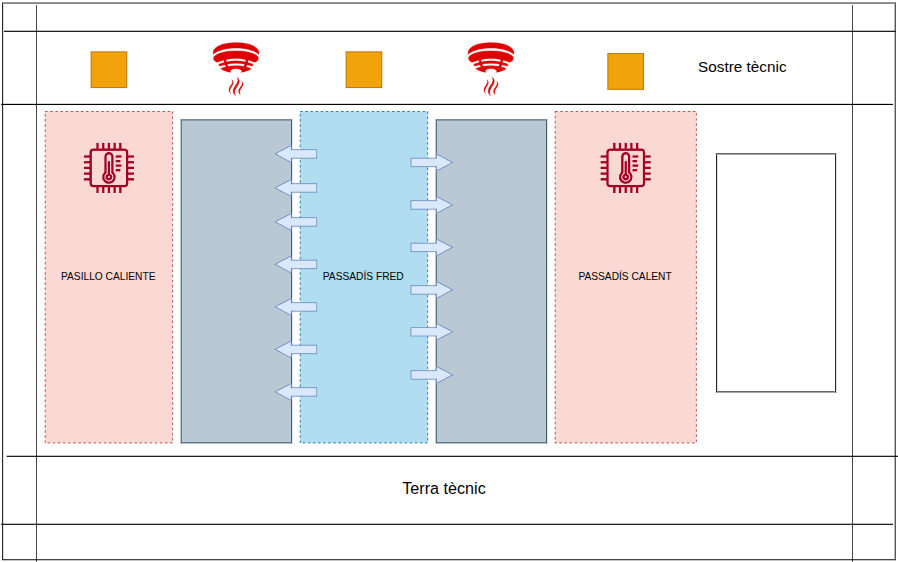

En el plano, el cuadrado naranja situado en el techo representa la salida de descarga del sistema de extinción de incendios por gas, que se instalaría fuera de la sala de servidores y se conectaría al sistema. 

Por otro lado,los símbolos rojos del techo corresponden a detectores ópticos de humo, y los elementos de las paredes identifican los sensores de temperatura encargados de detectar aumentos anormales de calor. 

#### Vías de evacuación

Aunque la sala del CPD es pequeña, es fundamental garantizar una evacuación rápida y segura en caso de emergencia. La evacuación es directa e inmediata hacia el exterior, y no se requieren vías alternativas ni puertas secundarias. 

La sala de servidores tiene una única puerta de salida, la cual está equipada con una barra antipánico, lo que permite abrirla inmediatamente desde el interior.

Señalización fotoluminiscente

En el suelo hay flechas fotoluminiscentes que indican la dirección hacia la puerta.

Iluminación de emergencia

En el pasillo hay instaladas dos luces de emergencia autónomas que se activan automáticamente en caso de corte de suministro eléctrico.

### 2. Seguridad Lógica

#### Restricción de acceso por autorización

Para garantizar la seguridad de los sistemas y de la información del CPD, se implantará un sistema de control de acceso de autenticación multifactorial (MFA), que consiste en verificar la identidad del usuario mediante múltiples factores de seguridad, los cuales se especifican en el apartado de seguridad física.

Registro y monitorización de los accesos

Todos los accesos se registrarán automáticamente en una base de datos centralizada con la siguiente información:

| ID del empleado | Fecha y hora de entrada | Tiempo dentro del CPD |
| --- | --- | --- |
| Nombre y apellido | Fecha y hora de salida | Intento de acceso denegado |

Esta información puede utilizarse para realizar auditorías de seguridad, ya que facilita comprobar si los accesos corresponden con las tareas programadas y garantiza el cumplimiento de las políticas internas. También resulta útil en la investigación de incidentes, ya que permite identificar quién se encontraba en la sala de servidores en un momento determinado o si se han producido intentos de acceso no autorizados.

Política de acceso

- Personal autorizado: únicamente técnicos de sistemas, responsables de TI y personal de mantenimiento debidamente acreditados.
- Acceso restringido las 24 horas del día, los 7 días de la semana: se puede acceder a la sala de servidores en cualquier momento, pero el acceso debe registrarse siempre en el sistema de control de accesos.
- Personal externo: cualquier proveedor externo o visitante debe ir siempre acompañado de personal interno autorizado, y su acceso también debe registrarse.

#### Firewall

Los firewall son elementos fundamentales para proteger la infraestructura de red del centro de datos frente al malware o los intentos de intrusión. Por este motivo, se implementarán los siguientes niveles:

- Firewall perimetral: controla todas las conexiones entrantes y salientes de la red, bloqueando los intentos de acceso externo no autorizados y aplicando políticas de seguridad predefinidas.
- Firewall interno por segmentación: permite separar los servicios y evita que un incidente de seguridad en un sistema se propague fácilmente al resto de la infraestructura.
- Listas de control de acceso (ACL): permiten controlar qué tráfico se permite dentro de la red. 

#### Monitorización

La supervisión del centro de datos permite un control constante de los servidores, la red y los sistemas de seguridad para detectar cualquier incidente de forma inmediata, antes de que afecte al funcionamiento de la infraestructura. 

- Sistema SIEM y registros centralizados: el CPD contará con un sistema SIEM (Security Information and Event Management) encargado de recopilar y analizar los registros generados, que se enviarán a un servidor de registros centralizado, lo que permitirá conservar un historial completo de las acciones y los eventos que se producen dentro de la infraestructura. 
- Alertas en tiempo real: cuando se detecte un incidente o una actividad sospechosa, se generarán alertas automáticas en tiempo real que se enviarán a los administradores del centro de datos. 

#### Copias de seguridad (Backups)

Estrategia 3-2-1

La infraestructura seguirá la estrategia 3-2-1 para reducir el riesgo de pérdida de datos. Esta política consiste en mantener tres copias de la información, utilizando dos soportes de almacenamiento diferentes y conservando una copia fuera de las instalaciones. 

Copias de seguridad

Para garantizar la recuperación de la información en caso de cualquier incidente, el centro de datos realizará copias de seguridad periódicamente:

- Diarias (incrementales): solo se guardan los archivos modificados desde la última copia de seguridad, lo que reduce el espacio necesario y el tiempo requerido para completar el proceso. 
- Semanal (completa): se generará una copia completa de todos los servidores y servicios principales para proporcionar un punto de restauración completo en caso de que sea necesario recuperar el sistema entero. 
- Mensual (fuera de las instalaciones): se guardará una copia fuera del centro de datos, ya sea en otro CPD o en la nube. 

#### RAID

Se utilizarán sistemas RAID en los servidores del centro de datos para aumentar la disponibilidad de los datos y reducir el riesgo de interrupción del servicio en caso de fallo de un disco duro. 

RAID 5: distribuirá los datos y la información de paridad entre varias unidades.

RAID 10: replica los datos en diferentes discos y distribuye la carga de trabajo.

Esta configuración permite que los servicios permanezcan activos incluso en caso de fallos en los discos y al mismo tiempo que garantiza un acceso a los datos a alta velocidad.

### 3. Medidas de prevención de riesgos laborales 

#### Seguridad elèctrica

Una de las principales fuentes de riesgo dentro del centro de datos es la infraestructura eléctrica. Los servidores, los SAI, las PDU y los sistemas de alimentación funcionan a altas tensiones y están en funcionamiento continuo, lo que puede suponer riesgos de electrocución o sobrecalentamiento si no se manejan correctamente.

Para reducir estos riesgos, cualquier trabajo en equipos eléctricos debe ser realizado únicamente por personal autorizado y formado. Además, antes de manipular determinados componentes, el equipo debe desconectarse de forma segura siempre que sea posible.

El personal técnico debe utilizar:

- Guantes dieléctricos.
- Herramientas aisladas.
- Calzado de seguridad con suela aislante.

#### Control ambiental y condiciones de trabajo

Los centros de datos generan grandes cantidades de calor debido al funcionamiento constante de los servidores y los equipos de red. Por este motivo, la sala estará equipada con sistemas de climatización que mantendrán unas condiciones ambientales estables para proteger los equipos y garantizar unas condiciones de trabajo adecuadas para el personal.

La temperatura y la humedad se mantendrán dentro de los niveles recomendados para evitar el estrés térmico, la condensación o la acumulación de electricidad estática. Además, las instalaciones se limpiarán periódicamente para evitar la acumulación de polvo, ya que esto puede afectar tanto a los equipos electrónicos como a la calidad del aire dentro de la sala.

#### Sonido y protección auditiva

Los sistemas de ventilación y refrigeración, así como los propios servidores, generan un nivel constante de ruido que puede resultar molesto o perjudicial en caso de exposición prolongada.

Para reducir la exposición, se recomienda limitar el tiempo que se pasa dentro del centro de datos y utilizar protección auditiva al realizar tareas prolongadas. 

#### Ergonomía 

La distribución del CPD se diseñará de manera que los técnicos puedan trabajar de forma segura y cómoda. Los pasillos entre los racks serán lo suficientemente amplios como para facilitar el desplazamiento y las tareas de mantenimiento. Además, se recomienda el uso de carritos y herramientas de apoyo para mover servidores o componentes pesados, con el fin de prevenir lesiones musculoesqueléticas. 

También se controlarán otros aspectos como:

- La iluminación adecuada en la sala.
- La organización del cableado en los racks para evitar cables sueltos en el suelo.
- La señalización de las zonas peligrosas.

## Nube 2. Despliegue de la Infraestructura Lógica en el Núvol (AWS)

### 2.1 Arquitectura de Red Virtual (VPC) y Seguridad Lógica

Antes de empezar con esto hemos hecho una imagen con respecto a nuestra distribución y cómo están conectados los servicios.

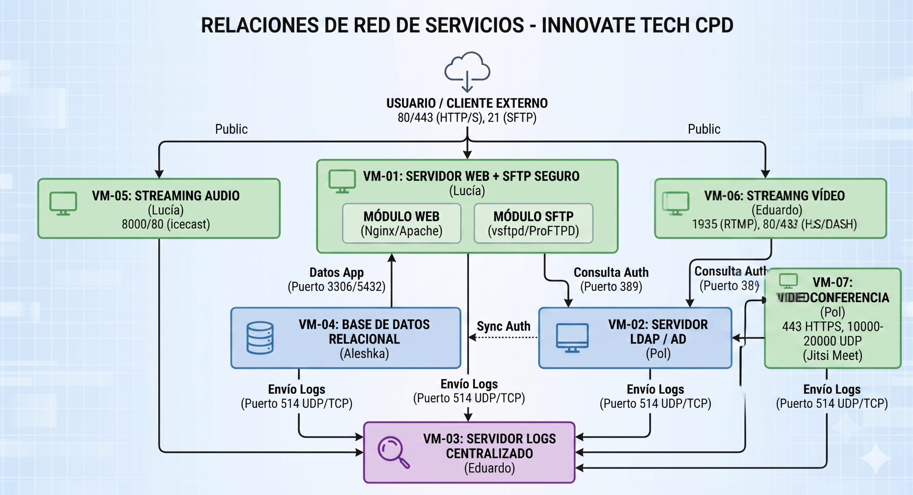

#### 2.1.1. Diseño de Subredes, Tablas de Enrutamiento e Internet Gateway

Documentar el elastic ip

#### 2.1.2. Configuración de Firewalls Lógicos (Security Groups)

### 2.2 Implementación de Servicios en Instancias EC2

#### 2.2.1. Servidor Web y Servicio SFTP Seguro (Autenticación AD)

Tenemos en funcionamiento el servicio de nginx

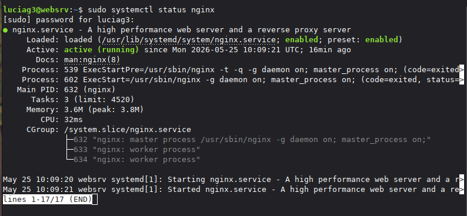

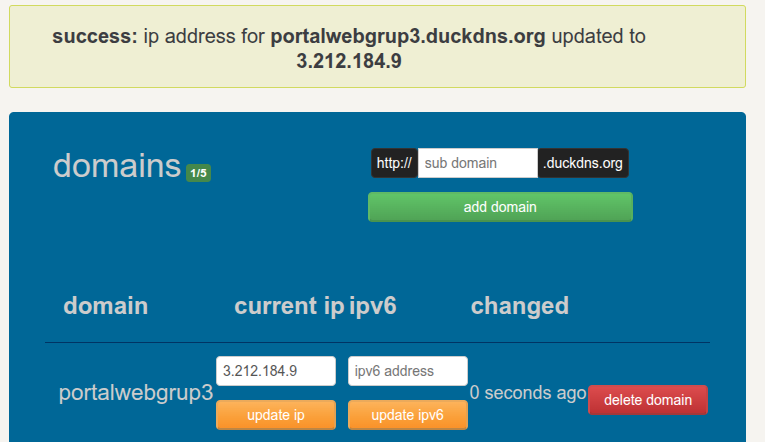

Para configurar SFTP debemos tener el servidor de OpenSSH y configurarlo.

Editamos el fichero /etc/ssh/sshd_config. Hacemos que use el puerto 2222 para que sea más seguro y añadimos un bloque Match para configurar los usuarios que usarán SFTP.

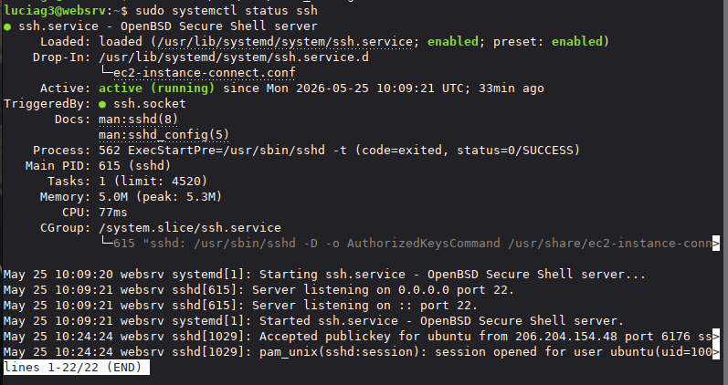

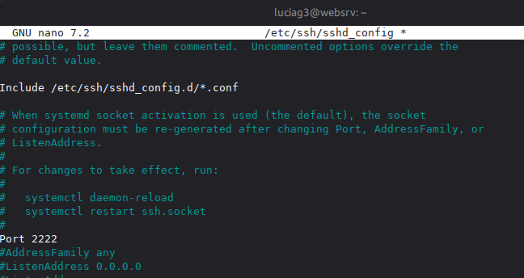

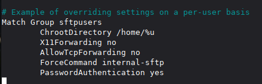

#### 2.2.2. Servidor de Directorio Activo (LDAP/AD)

Instalamos el paquete de ldap desde la terminal de una máquina linux

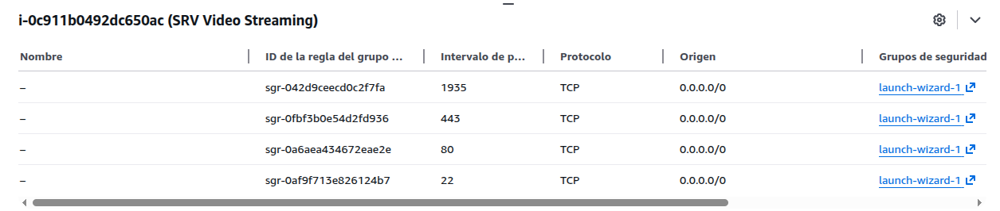

Configuración del servicio de ldap

Especificamos el nombre de dominio.

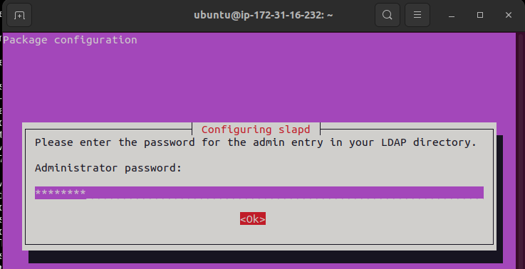

Ponemos la contraseña de administrador de LDAP

Mensaje conforme la configuración ha sido correcta.

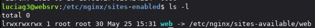

Para organizar a los empleados y los grupos creamos un archivo .ldif

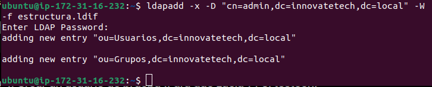

Ahora cargamos el archivo en la base de datos de LDAP y como se puede ver se ha añadido todo correctamente.

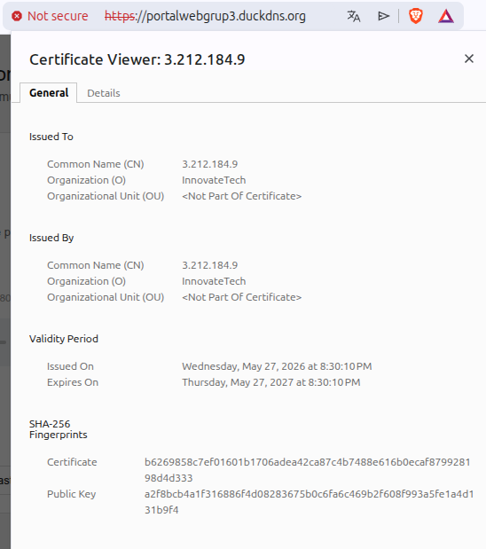

Creamos el archivo usuarios.ldif para a posteriori poder crear los usuarios.

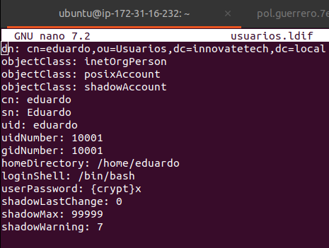

Creación del usuario Eduardo

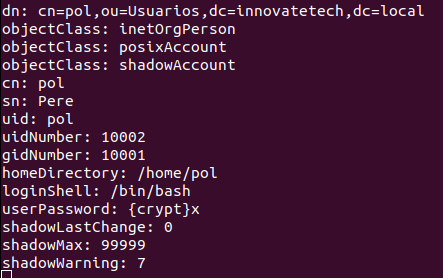

Creación del usuario Pol

Creación del usuario Lucia

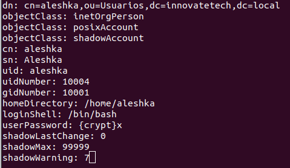

Creación del usuario Aleshka

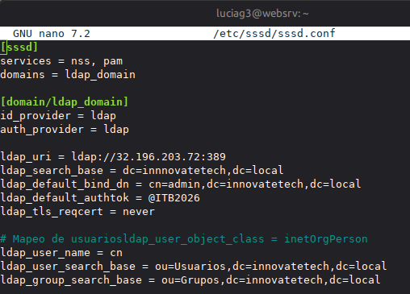

Añadimos los usuarios al directorio.

Asignamos contraseñas para cada uno de los usuarios en este caso @ITB2026 para todos para que cuando avancemos en el proyecto no haya confusiones o problemas.

Creamos el playbook de ansible:

Ejecutamos el playbook y como se puede ver todo ha funcionado correctamente.

#### 2.2.3. Servidor de Centralización de Logs del Sistema

Creamos el usuario edug3

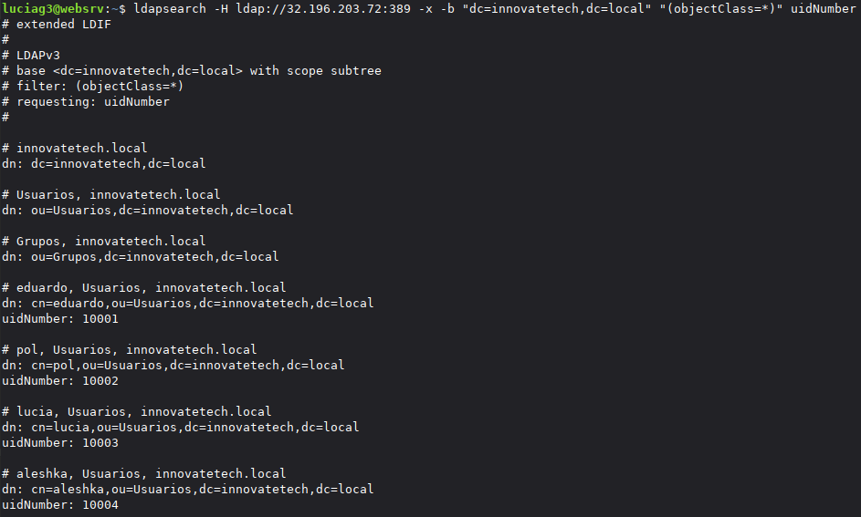

Desplegamos una máquina virtual VM-03 en AWS que nos servirá para centrar los logs, esta máquina tendrá como hardware virtual lo siguiente.

AMI → Ubuntu server 24.04 LTS ya que es la más estable, tiene larga duración de soporte y su compatibilidad.

Tipo de instancia → t3.medium, escogemos este ya que para nuestro proyecto necesitamos algo que nos vaya bien para los 7 servicios sin saturarse.

Grupo de seguridad → Por el momento escogemos el grupo de seguridad por defecto pero más adelante tenemos que cambiarlo para asegurar que los servidores se comuniquen y garantizar su correcto funcionamiento.

Almacenamiento → Para nuestro entorno reducido escogemos 30 GB

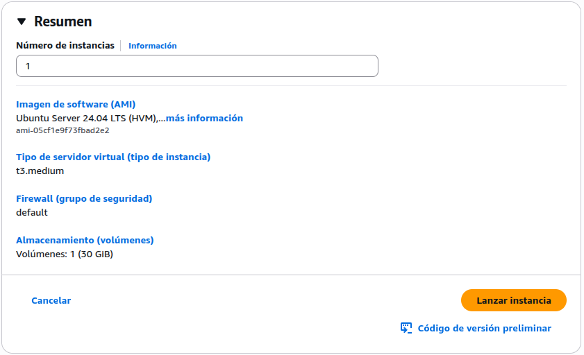

Pasamos con la instalación de nuestros servicios para el servidor de log, hemos decidido usar Elasticsearch, Kibana Y Auditbeat para los clientes.

Primeramente comenzamos con la instalación de Elasticsearch y Kibana, en el servidor VM-05 SRV LOG:

Descargamos el paquete de Elasticsearch y kibana desde la web con wget, para ambos servicios descargamos la versión 9.4.1 porque es la más estable y segura hasta el momento para este entorno de producción.

- Elasticsearch

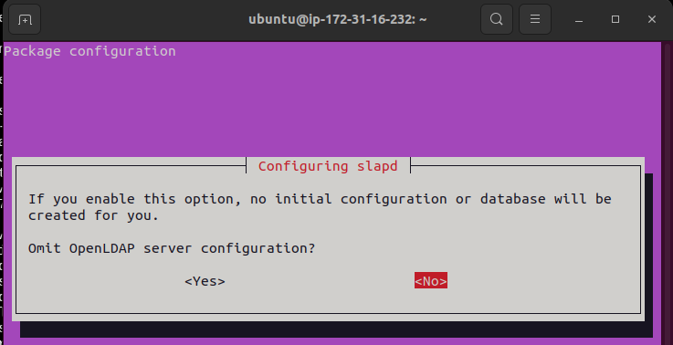

Descomprimimos el paquete y continuamos con la instalación

Aquí se puede ver como hemos descomprimido el archivo con tar -xvzf.

Luego continuamos con la instalación de elasticsearch, para eso tenemos que ejecutar el script

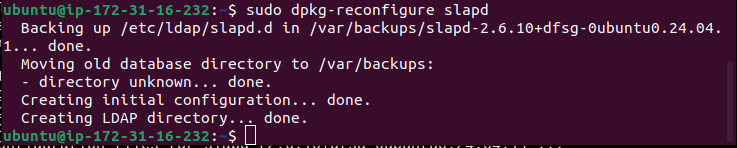

La instalación nos dará la contraseña para el usuario elastic, un certificado y además el toquen para kibana, es importante mantener esta información guardada

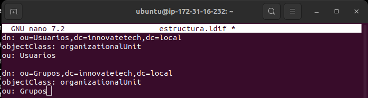

ℹ️  Password for the elastic user (reset with `bin/elasticsearch-reset-password -u elastic`):

jkG=x3qu7hlSpviDAKNe

ℹ️  HTTP CA certificate SHA-256 fingerprint:

767b250b9c683ae7832a51bced0bbf25f6980ce006cb26aa9a2f4c1557fa8bab

ℹ️  Configure Kibana to use this cluster:

• Run Kibana and click the configuration link in the terminal when Kibana starts.

• Copy the following enrollment token and paste it into Kibana in your browser (valid for the next 30 minutes):

eyJ2ZXIiOiI4LjE0LjAiLCJhZHIiOlsiMTcyLjMxLjI0LjIzMDo5MjAwIl0sImZnciI6Ijc2N2IyNTBiOWM2ODNhZTc4MzJhNTFiY2VkMGJiZjI1ZjY5ODBjZTAwNmNiMjZhYTlhMmY0YzE1NTdmYThiYWIiLCJrZXkiOiJKV2VrUlo0QldqOHN0ODh0LV9ZdzpRdnNuNGVxQTJzRzFXUFdyZHNYSUdnIn0=

—---------------------------------------------------------------------------------

Ahora haremos que el servicio elasticsearch se levante solo cada que iniciemos la máquina sin la necesidad de tener que ejecutar un script para activarlo, para ello creamos un archivo del elasticsearch en la ruta etc/systemd/system/elasticsearch.service
Dentro de ese fichero tendrá esta configuración.

Description: El nombre del programa que veremos al hacer un status.

After=network.target: Le prohíbe arrancar hasta que el servidor de AWS tenga internet e IP, evitando errores de conexión.

Type=simple: Le dice a Linux que el programa se queda abierto controlando el proceso.

User/Group=edug3: Corre con el usuario edug3 y no como root para que nadie pueda hackear todo el servidor desde fuera.

ExecStart: La ruta exacta del archivo que enciende el Elasticsearch portátil.

Restart=on-failure: Si el servicio se apaga por un fallo o falta de RAM, Linux lo vuelve a encender solo.

LimitNOFILE=65535: Le permite abrir miles de archivos de datos a la vez sin que Linux lo cape.

LimitNPROC=4096: Le permite usar hasta 4096 hilos de la CPU para procesar búsquedas rápido.

LimitMEMLOCK=infinity: Bloquea los datos en la memoria RAM para que no se muevan al disco, manteniendo la velocidad al máximo.

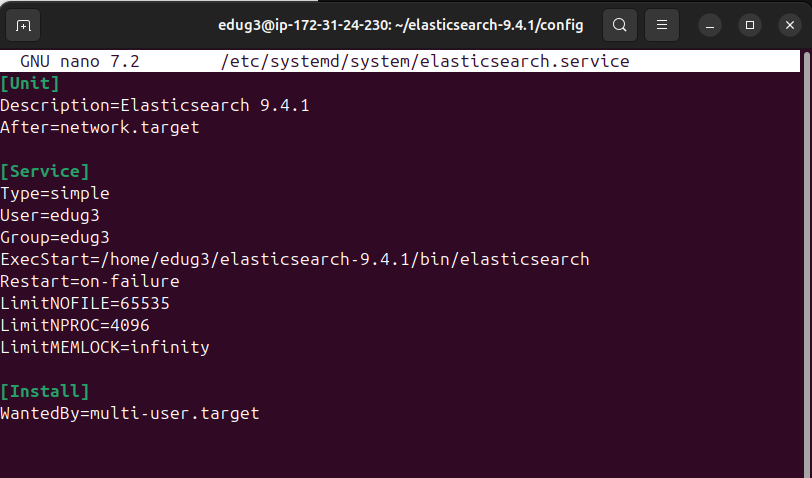

Una vez terminemos con el archivo de configuración pasamos a habilitar el servicio, y como podemos ver está activo

Para permitir que nos conectemos desde cualquier otra máquina que no sea localhost habrá que cambiar la linea de network.host por 0.0.0.0 para que escuche para todas las interfaces 

Comprobamos que nos podemos conectar desde una máquina diferente por medio del navegador https://52.7.181.195:9200/ , tenemos que poner las credenciales que anteriormente nos dieron

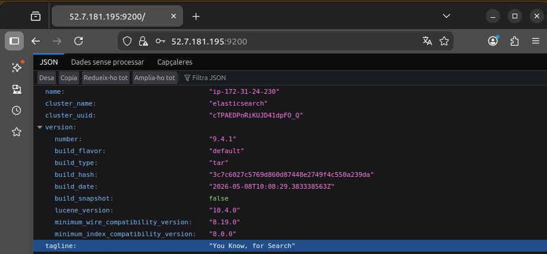

- Kibana

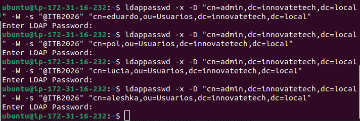

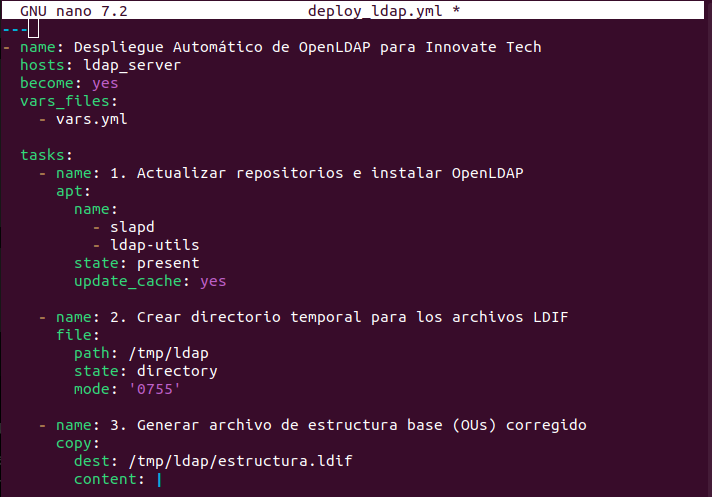

eyJ2ZXIiOiI4LjE0LjAiLCJhZHIiOlsiMTcyLjMxLjI0LjIzMDo5MjAwIl0sImZnciI6Ijc2N2IyNTBiOWM2ODNhZTc4MzJhNTFiY2VkMGJiZjI1ZjY5ODBjZTAwNmNiMjZhYTlhMmY0YzE1NTdmYThiYWIiLCJrZXkiOiJ6S3RhU1o0QmNvNzd5RklzZXFIWTo4LUhhRlJTR2czTUotSzVsVkE1MUFRIn0=

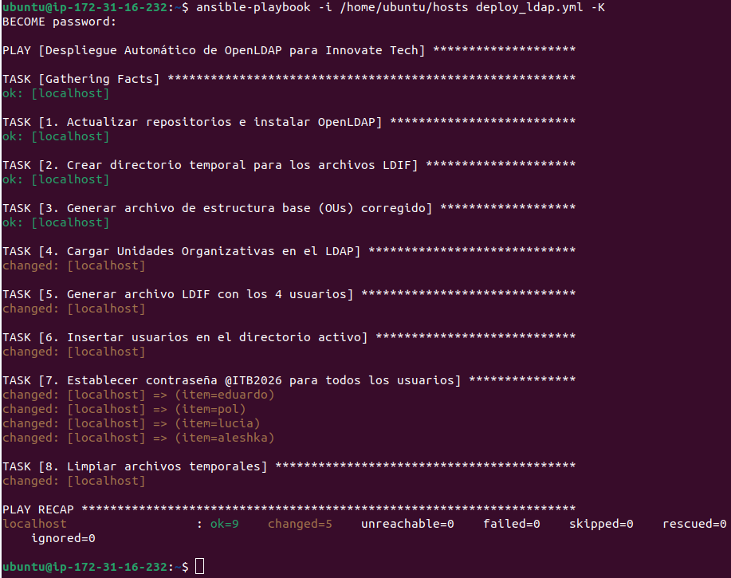

Luego nos conectamos a kibana http://52.7.181.195:5601, ponemos las credenciales usuario elastic y la contraseña que nos dio elastic antes

Ahora automatizamos que al iniciar el servidor de logs el servicio kibana se inicie sin necesidad de ejecutar el script, para ello primero nos creamos el fichero en /etc/systemd/system/kibana.service

Description: El nombre del servicio que verás al hacer el status

After=elasticsearch.service: Le prohíbe a Kibana arrancar hasta que Elasticsearch esté encendido y listo

Type=simple: Indica que el programa corre de forma continua en un proceso directo.

User/Group=edug3: Seguridad. Corre con tu usuario normal para que nadie pueda hackear la raíz (root) del servidor.

ExecStart: La ruta exacta del archivo que enciende Kibana.

Restart=on-failure: Si Kibana se cae o da un error, Linux lo vuelve a levantar solo.

Environment=NODE_ENV=production: Optimiza Node.js para que consuma menos RAM y vaya más rápido en la web.

Y ya comprobamos que está como un servicio

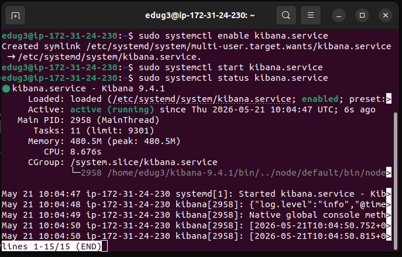

CLIENTE - Auditbeat

Este proceso se hará en todos los servidores para poder recopilar sus logs, en este caso se puede ver como se hace el proceso de instalación desde un servidor pero los demás servidores siguen el mismo modelo

Instalamos el paquete auditbeat

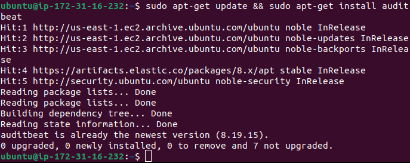

Configuramos el archivo auditbeat.yml para poder conectarme al server de elasticsearch y kibana para poder enviar logs.

Hacemos la comprobación de que todo el archivo se ha configurado correctamente.

Confirmamos que el servicio de auditbeat tiene conexión y que el archivo .yml está correctamente configurado.

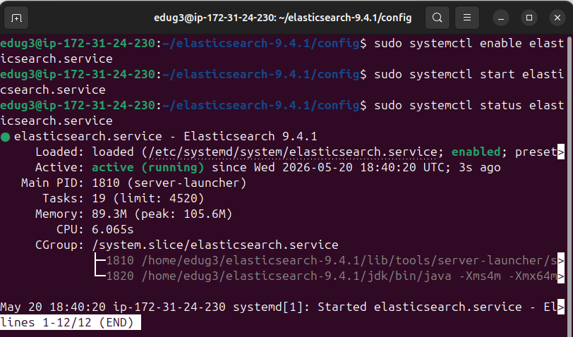

Comprobamos que nos deja acceder poniendo en la barra del buscador esto: http://52.7.181.195:5601 y ponemos el usuario y contraseña que nos ha facilitado el administrador de logs.

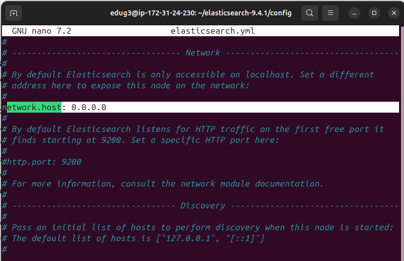

Aquí se puede ver como hemos podido acceder correctamente a kibana.

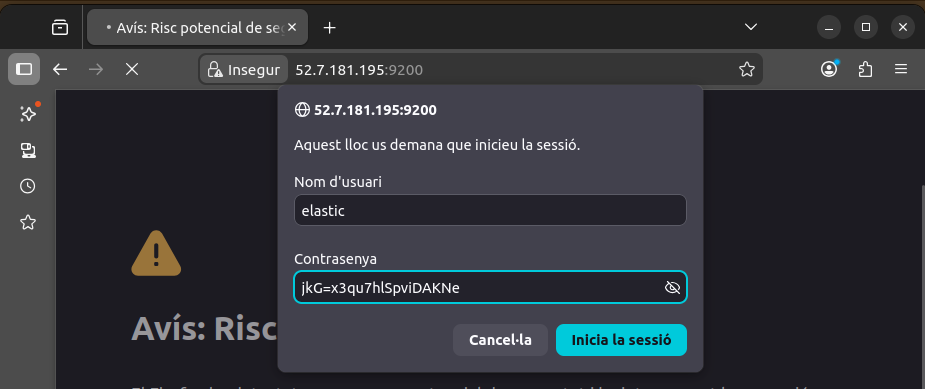

Ahora comprobamos que se puede acceder a elasticsearch, nos vuelve a pedir usuario y contraseña que son los mismos que para acceder a kibana.

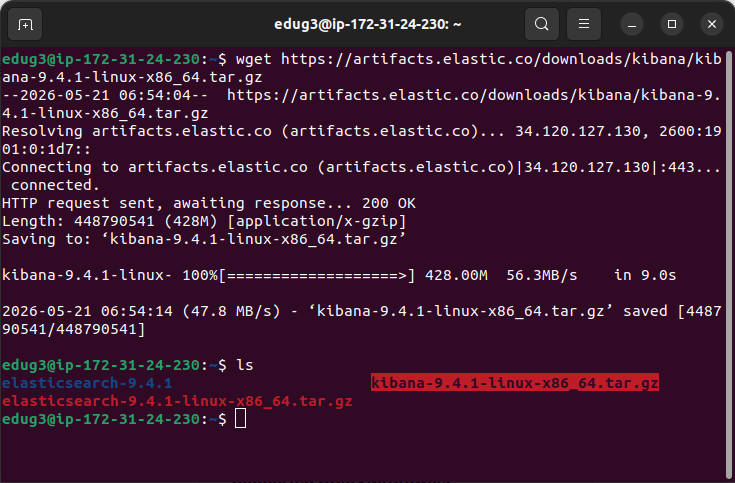

Ahora hacemos un cambio de usuario y ejecutamos una comanda con dicho usuario  para que se pueda ver reflejado en kibana.

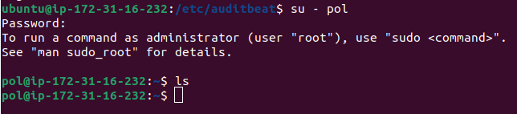

Aquí se puede ver como queda todo registrado en los logs de kibana.

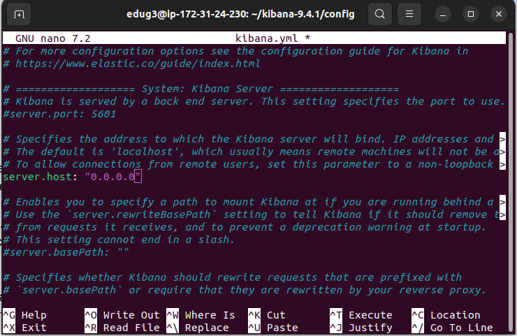

### 2.3 Automatización, Accesos y Gestión de Configuración

#### 2.3.1. Configuración de la Gestión Mediante Ansible (Playbooks)

#### 2.3.2. Gestión de Usuarios de Administración y Políticas de Llave Pública/Privada

## 3. Implantación de Servicios Multimedia y Redes

### 3.1. Servicio de Distribución de Audio Streaming

#### 3.1.1. Descripción de la Funcionalidad del Servicio de Audio

Un servicio de streaming de audio sirve para dar acceso a usuarios a contenido de audio como música o podcasts en tiempo real, sin necesidad de que descarguen el contenido localmente.

#### 3.1.2. Guía de Instalación y Configuración del Servidor de Audio

Instalamos Icecast2 y Liquidsoap.

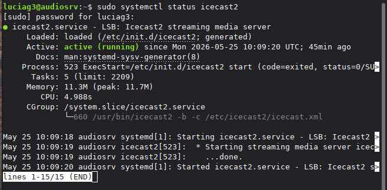

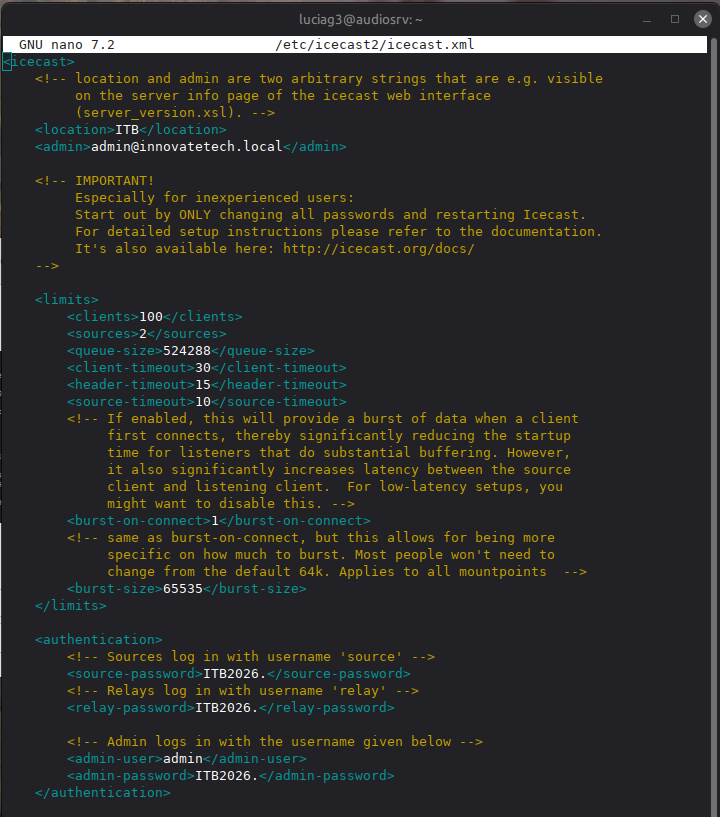

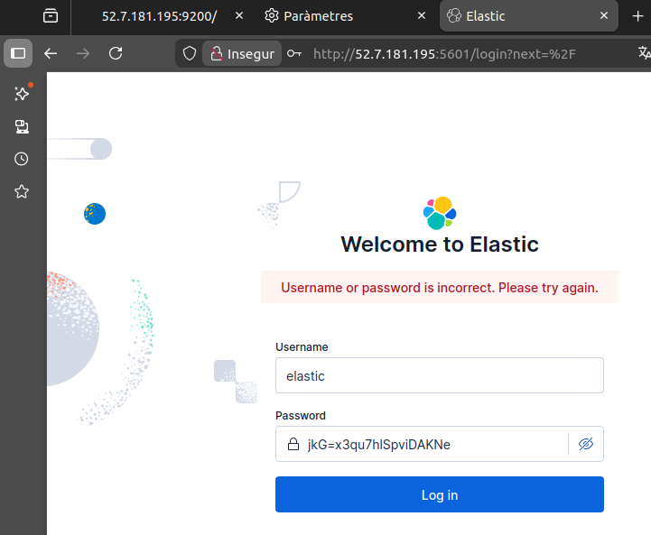

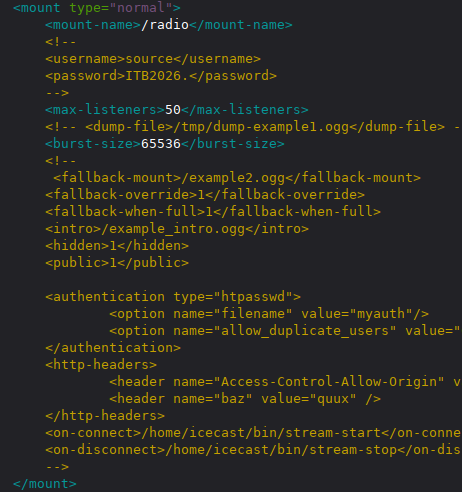

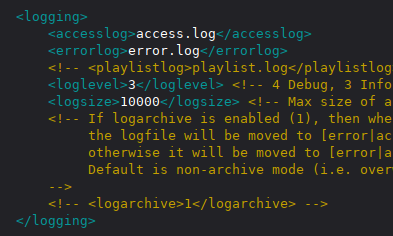

También instalaremos el servicio de Liquidsoap, encargado de enviar 

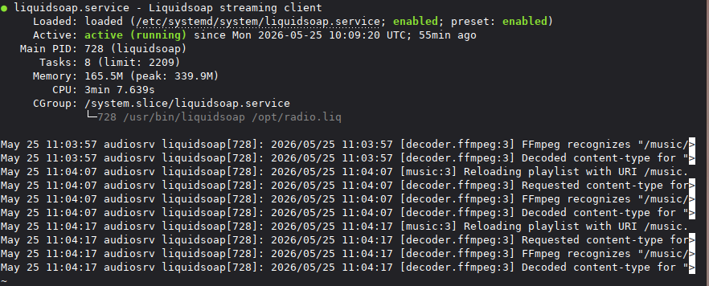

El servicio de liquidsoap no existe nativamente en systemd, lo creamos más adelante.

Creamos un fichero .liq donde definimos la configuración para el canal radio. En este fichero definimos que la ruta donde se encuentran los archivos de audio que se distribuirán están en el directorio /music.

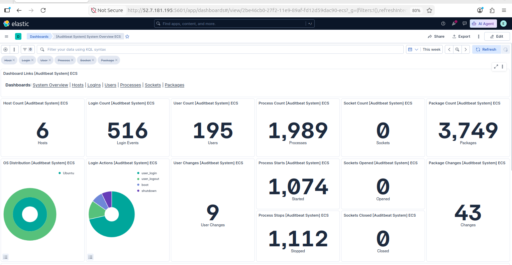

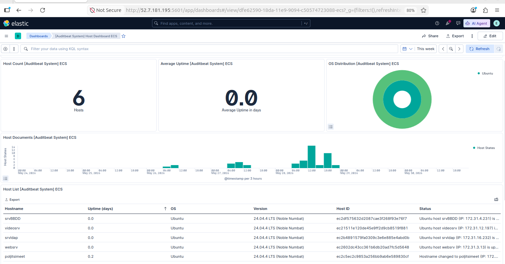

Lo arrancamos con liquidsoap, indicando el fichero de configuración del canal.

Mientras tenemos los dos servicios arrancados ya podemos acceder por el navegador con la IP y el puerto 8000 al panel de Icecast2. Si queremos acceder a nuestro canal de radiodifusión debemos introducir el nombre de este en el navegador.

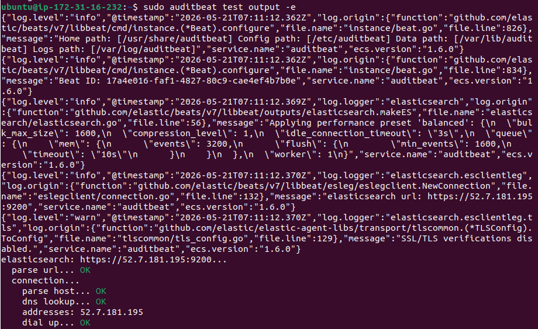

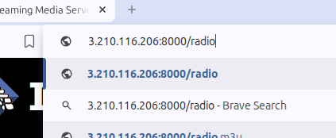

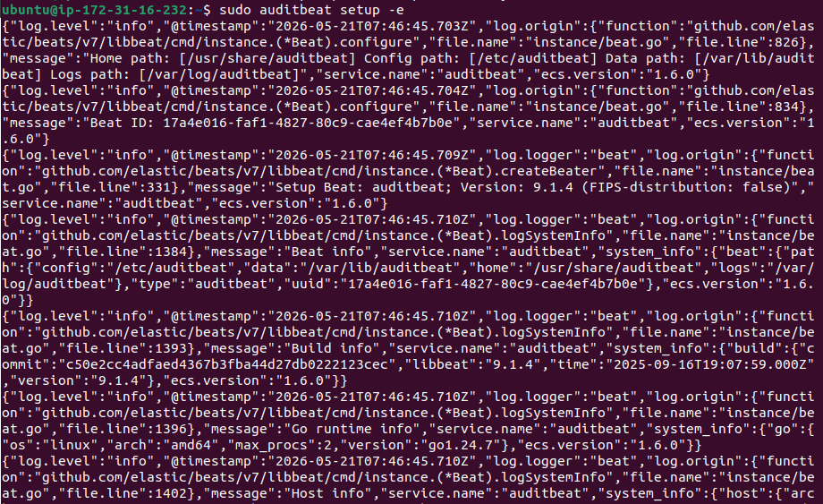

Creamos el servicio para systemd, de esta manera no habrá que arrancarlo de manera manual en cada ocasión. En el fichero se especifican dos cosas importantes:

La primera es que debe arrancarse cuando icecast2 esté listo, pues el liquidsoap depende de este. Lo segundo es la línea donde se especifican los canales que deben enviarse. Vemos que en ExecStart se ejecutará el arranque de liquidsoap junto la ruta del archivo del canal. Después solo debemos ejecutar systemctl enable para que se ejecute automáticamente en el arranque de la máquina.

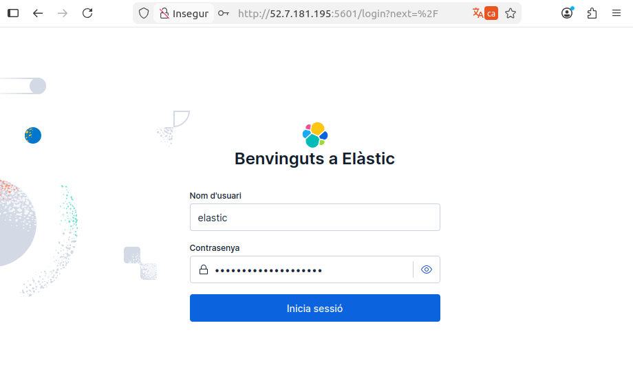

#### 3.1.3. Justificación del Uso de Formatos Digitales (MP3/AAC/OGG)

#### 3.1.4. Pruebas de Validación, Acceso Web y Multi-cliente (Evidencias)

### 3.2. Servicio de Vídeo Streaming y Videoconferencia

#### 3.2.1. Descripción de la Funcionalidad del Servicio de Vídeo

El servicio implementa un modelo de Vídeo bajo Demanda, diseñado para distribuir contenidos multimedia pregrabados a los usuarios de la plataforma de forma fluida y eficiente.

Su funcionamiento se basa en la cooperación de dos herramientas:

- FFMPEG: Coge los vídeos originales (.mp4), los codifica en el estándar universal H.264 y los fragmenta en bloques de 3 segundos (.ts), creando un archivo de índice (.m3u8) que actúa como mapa del contenido.

- Nginx: Actúa como servidor de transferencia utilizando el protocolo HLS (HTTP Live Streaming), encargándose de entregar los fragmentos de vídeo a los clientes a medida que los van reproduciendo.

Al transmitir el vídeo por fascículos en lugar de descargar el archivo entero, optimizamos el ancho de banda de la infraestructura en AWS, eliminamos los tiempos de espera y permitimos que los vídeos se reproduzcan de forma nativa en cualquier navegador o integrados en la web principal.

#### 3.2.2. Configuración del Servidor de Vídeo y Protocolos de Streaming (RTMP/HLS)

Lanzamos la instancia para el servidor de Video Streaming el cual usaremos

Ubuntu 24.04 → Ya que es estable
t3.medium → Para el servidor de video streaming creemos que con 2cpu y 4 de ram para nuestro entorno es suficiente

Grupo de seguridad → Es uno nuevo con diferentes reglas de entrada

Almacenamiento → 30 GB es suficiente para almacenar más de un video y los usuarios puedan acceder sin saturarse

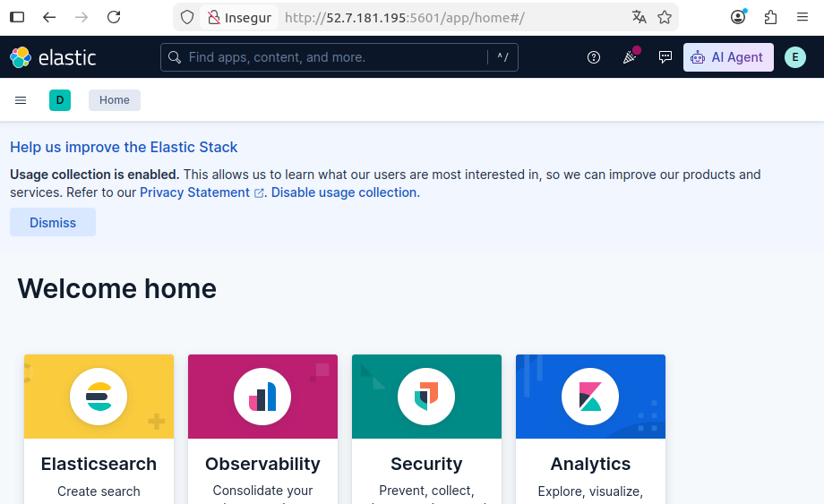

Luego nos conectamos mediante ssh y continuamos con las instalación, primeramente instalaremos el servicio nginx pero en este caso para video, usamos nginx ya que es el que usa menos CPU y RAM al gestionar las conexiones. Además añadimos el módulo libnginx-mod-rtmp, este módulo le añade la capacidad de entender protocolos multimedia en tiempo real, lo que hace que sea un servidor de streaming. También añadimos el módulo ffmpeg para que nos ayude a preparar y trocear el video y que los reproductores modernos lo puedan leer.

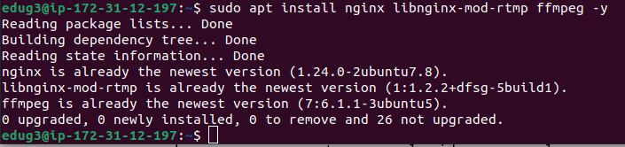

A continuación creamos dos carpetas separadas, en /vod guardaremos los archivos originales completos mientras que en /hls es donde nginx creará y destruirá los trozos temporales de video en tiempo real. Como Nginx corre con el usuario www-data entonces es importante cambiarle el propietario a /var/www/html para luego no tener problema de permisos

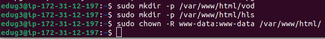

Luego pasamos a editar el archivo de configuración de nginx para agregar un bloque.
rtmp {} → RTMP(Real Time Messaging Protocol), Activa el motor multimedia de nginx para procesar video, independientemente de la web normal

server {} → Define un servidor virtual para gestionar el streaming

listen 1935 → Abre el puerto para recibir video, es el estándar para transmisión de video en vivo

chunk_size 4000 → Corta el video en paquetes de red de 4000 bytes para no saturar la cpu

application live {} → Crea el canal o ruta URL donde se enviará el video

live on → Activa la emisión en directo para que muchos usuarios se conecten a la vez

hls on → Traduce el video al protocolo HLS para que sea compatible con cualquier navegador web

hls_pat /var/www/html/hls → La carpeta del disco donde se guardan los trozos de video para  que la web los pueda servir

hls_fragment 3s → Corta el video en trozos de 3 segundos, evita esperas al usuario y no satura el servidor 

hls_playlist_lenght 60s → Mantiene solo el último minuto de disco para que no se llene el almacenamiento de aws

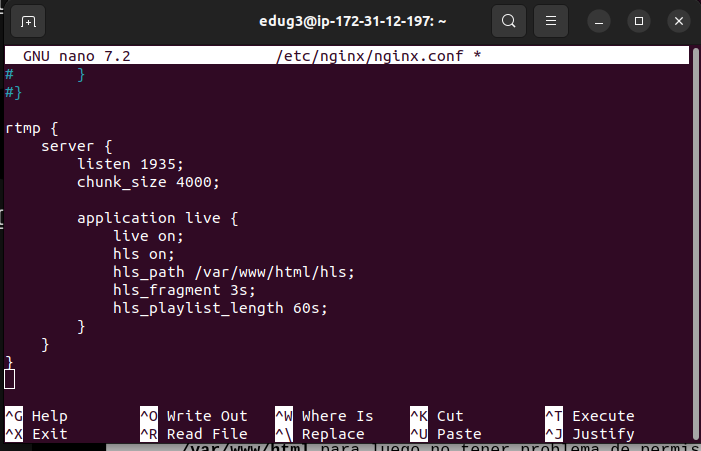

location /hls {} → Crea la ruta web, todo lo que pongamos en esa carpeta se podrá ver desde internet

types {} → Es como si le dijera al navegador que el video es de streaming por lo tanto no lo descargará pero lo reproducirá en pantalla

root /var/www/html → La ruta real del disco de aws donde se están guardados los trozos de video

add_header Cache-Control no-cache → Evita que el navegador guarde el video en su memoria interna, asi el video no se queda congelado o en bucle

add_header Access-Control-Allow-Origin * → Le da permisos al servidor web para que pueda poner los videos que están alojados en el servidor de streaming en su página sin que el navegador lo bloquee por seguridad

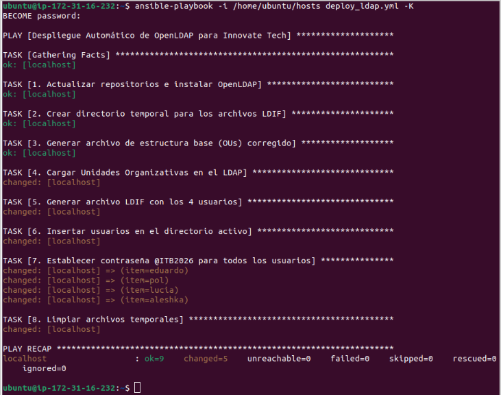

Es importante que después de haber cambiado la configuración verifiquemos la sintaxis del archivo on nginx -t, luego reiniciamos el servicio 

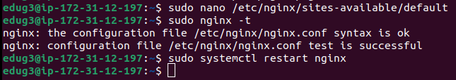

Hemos escogido un video que sacamos de la página del itb para tener guardado en el servidor de streaming, nos lo compartimos mediante sftp haciendo uso de la clave que tenemos, luego lo movemos al directorio var/www/html/vod que es donde se guardan los archivos originales 

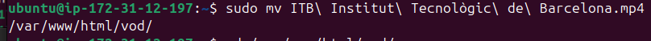

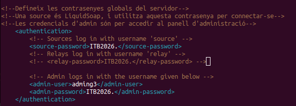

-i → Indica el archivo de video original que quiere convertir

-codec:v libx264 → Convierte el vídeo al formato H.264, el único estándar universal que abren todos los navegadores web del mundo sin dar errores

-codec:a aac → Convierte el audio a formato AAC, optimizado para que pese poco y se escuche perfecto en internet

-f hls → Fuerza a que el formato de salida sea HLS (streaming por fascículos)

-hls_time 3 → Ordena cortar el vídeo en trozos exactos de 3 segundos

-hls_playlist_type vod → Le dice que es "Vídeo bajo Demanda" . El vídeo tiene un principio y un final, no es una tele en directo

/.../index.m3u8 → El archivo final que se genera. Es el índice de texto que contiene la lista de todos los trozos de 3 segundos (.ts). El reproductor lee este índice para saber qué trozo va detrás de cuál

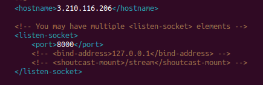

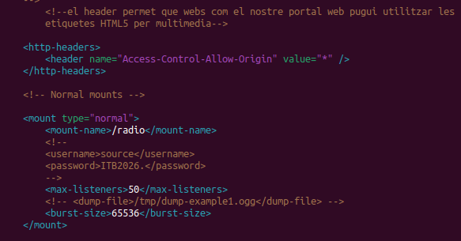

Comprobación de que el archivo original se troceó

Es importante abrir los puertos necesarios para la conexión como son el http y https, para que los usuarios puedan ingresar. Como tenemos ya un servidor web que se conectará a este servidor para que se reproduzcan los videos es importante también tener el puerto 1935 RTMP abierto.

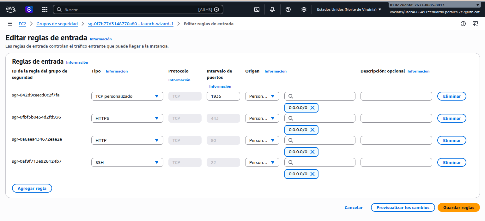

Comprobamos el funcionamiento del servidor de streaming y podemos ver que el que video se puede visualizar en el portal web de la empresa.

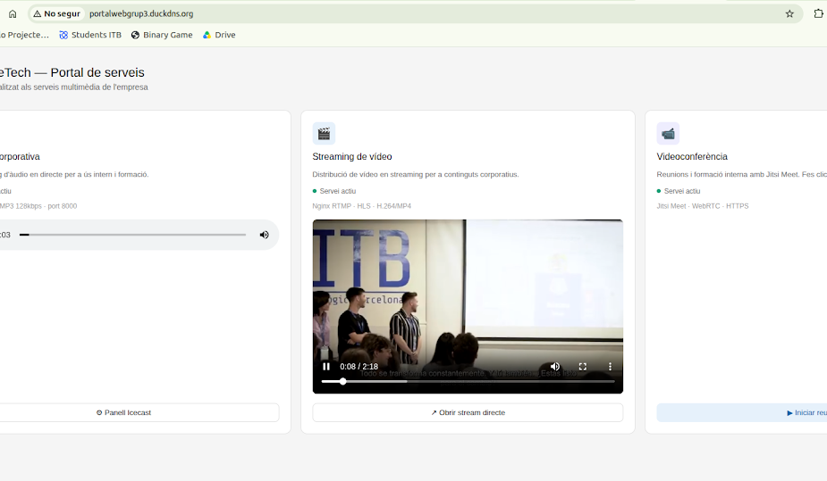

#### 3.2.3. Formatos y Códecs Utilizados (H.264 / MP4)

Para que los vídeos se reproduzcan en cualquier dispositivo sin dar problemas de compatibilidad, utilizamos los estándares más eficientes de la industria:

- Contenedor .mp4: Es el formato del archivo original que subimos al servidor. Lo elegimos porque es el más común y encapsula perfectamente el vídeo y el audio en un solo archivo.

- Códec de vídeo H.264: Es el encargado de exprimir y comprimir el vídeo, ofrece una buena calidad de imagen ocupando muy poco espacio en el disco de AWS, además es el único que abre el 100% de los navegadores actuales de forma nativa.

- Códec de audio AAC: Es el formato para el sonido, consigue una calidad de audio superior al MP3 pero pesando mucho menos, lo que ahorra ancho de banda en la red.

Aunque partimos de un archivo .mp4, el sistema HLS lo trocea en archivos pequeños. Así nos aseguramos de que el vídeo pese poco, viaje rápido y se abra en cualquier pantalla a la primera.

#### 3.2.4. Despliegue de la Plataforma de Videoconferencia (Jitsi Meet)

Creamos una nueva máquina y actualizamos los paquetes:  

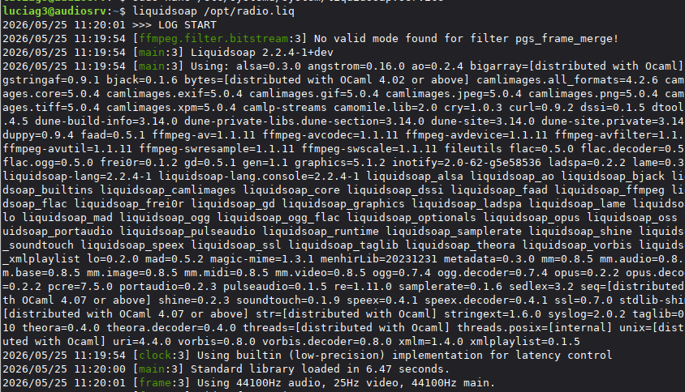

Entramos a duckdns.org y nos logueamos con la cuenta del instituto.

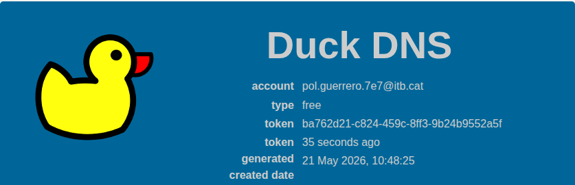

Una vez nos registramos nos saldrá la opción de crear un dominio, simplemente ponemos el nombre que queramos y le damos a add domain.

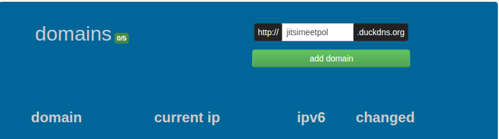

Una vez se crea el dominio nos saldrá esta pantalla donde solamente hemos de poner nuestra ip elástica.

Y nos saldrá un aviso conforme la ip se ha cambiado correctamente para el dominio jitsimeetpol. 

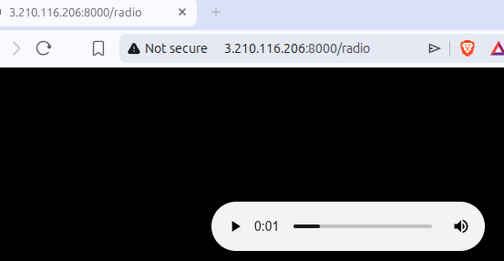

Cambiamos el hostname:

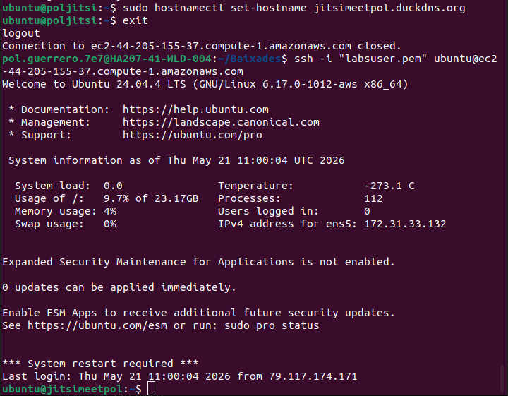

Configuramos el archivo /etc/hosts poniendo nuestro dominio

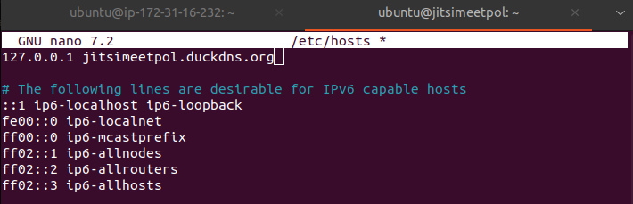

Añadimos el repositorio de Jitsi y hacemos un sudo apt update final para actualizar todos los paquetes:

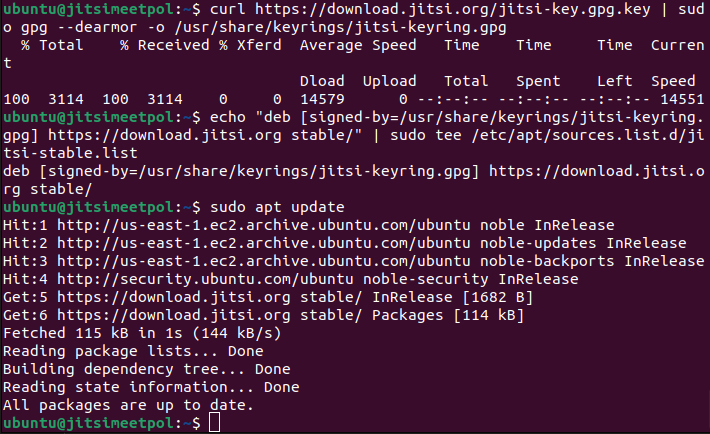

Una vez instalamos el paquete con sudo apt install jitsi-meet -y empezamos a configurar primero poniendo el nombre de dominio:

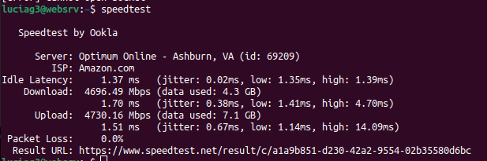

Luego nos pide el tipo de certificado ssl y elegimos la opción de Let's Encrypt certificates porque es gratuito y reconocido por los navegadores sin generar avisos de seguridad.

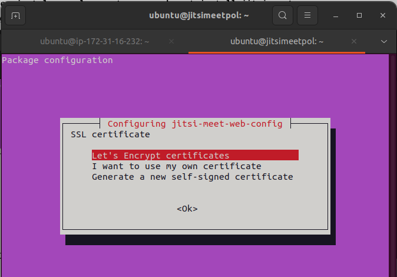

En la siguiente ventana nos pide un correo	 electrónico para poder emitir el certificado Let's Encrypt.

Una vez hemos acabado con la configuración verificamos que el servicio de jitsi está corriendo perfectamente.

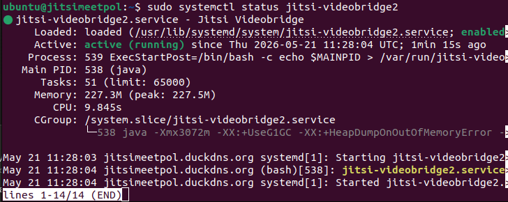

Luego añadimos estas líneas al archivo sip-communicator.properties porque Jitsi está instalado en AWS, que usa NAT. Esto significa que la maquina virtual tiene una IP privada interna pero el tráfico de vídeo necesita salir por la IP pública.

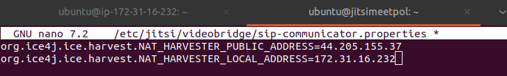

Y reiniciamos el servicio:

Ahora vamos al navegador y escribimos: https://jitsimeetpol.duckdns.org y como se puede ver funciona perfectamente.

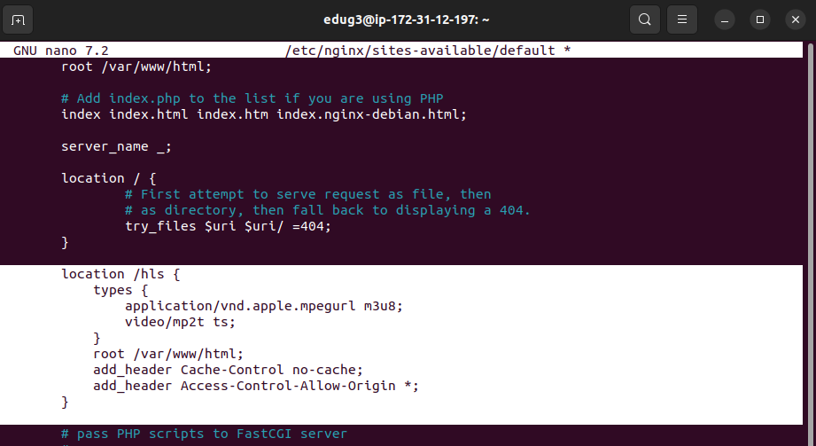

Creamos una reunión de prueba y le damos a inicia la reunión:

Aquí se puede ver lo que sería la sala: 

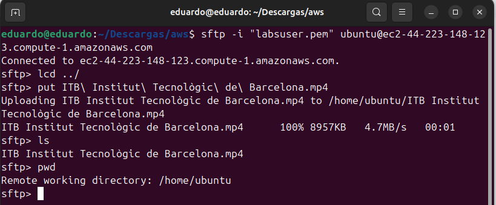

3.2.5. Análisis del Protocolo WebRTC y Evidencias de Videollamada Real

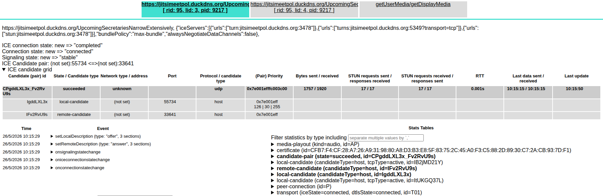

### 3.3. Pruebas Transversales de Rendimiento y Ancho de Banda

#### 3.3.1. Metodología de las Pruebas y Métricas (Download, Upload, Latencia)

Para comprobar la velocidad real del servidor en AWS, ejecutamos la herramienta speedtest-cli desde la terminal. El test se realizó contra el servidor de *Pilot Fiber* en Ashburn, Virginia, obtenemos los siguientes resultados:

- Latencia (Ping): 2.45 ms → La respuesta del servidor es instantánea al pedir el vídeo.

- Download (Descarga): 1212.64 Mbit/s → Velocidad de sobra para bajar actualizaciones o subir nuevos vídeos al disco.

- Upload (Subida): 1818.86 Mbit/s → Es la velocidad a la que el servidor envía los trozos de vídeo.

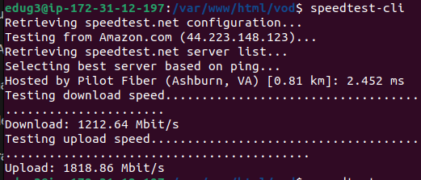

#### 3.3.2. Análisis Correlativo del Consumo Multimedia Simultáneo

Sabiendo que la subida real de la máquina es de 1818.86 Mbit/s, hacemos un cálculo rápido de capacidad:

- Un vídeo estándar optimizado con FFMPEG consume unos 2 Mbit/s por usuario.
- Dividiendo el ancho de banda total entre el consumo por alumno 1816.86/2, el servidor aguanta 909 reproducciones simultáneas.

Gracias a que el protocolo HLS trabaja por fascículos de 3 segundos (el navegador pide trozos a demanda y no descarga el vídeo entero de golpe), el consumo de red es progresivo y escalonado.

#### 3.3.3. Dictamen de Clasificación del Sistema (Acceptable / Not Acceptable)

El dictamen final es ACEPTABLE, el servidor Nginx responde a la perfección a la hora de repartir el contenido multimedia a los usuarios. La conexión que nos da AWS es tan rápida que evita cualquier tipo de atasco en la red. Además, el sistema de almacenamiento se comporta de forma totalmente estable, logrando que todos los archivos de vídeo se queden guardados de manera permanente y segura en el disco.

#### 3.3.4. Propuestas Técnicas de Optimización

De cara al futuro, se proponen tres mejoras:

1. Uso de AWS CloudFront (CDN): Guardar los trozos de vídeo en servidores espejo más cercanos a España para reducir el tráfico internacional desde Virginia y acelerar la carga.
1. Bitrate Adaptativo (ABR): Configurar FFMPEG para crear el vídeo en varias calidades (480p, 720p, 1080p) para que el reproductor se adapte automáticamente a la conexión de cada persona.
1. Activar HTTP/2 en Nginx: Para que el navegador descargue los múltiples archivos .ts a través de una sola conexión, haciendo la carga más eficiente.

# 4. Diseño y Administración de la Base de Datos

## 4.1 Diseño de la base de datos

### 1. Diseño diagrama Entidad-Relación

### 2. Diseño del modelo relacional

## 4.2 Implementación de la base de datos 

### 1. Elección del SGBD

### 2. Creación de la BBDD

## 4.3 Gestión de usuarios, roles y permisos

### 1. Definición de roles

### 2. Script para automatizar la creación de usuarios

## 4.4 Triggers para control de accesos y Auditoría

### 1. Control de cuotas de los usuarios

### 2. Tabla de avisos y auditoría

### 3. Gestión de bloqueo de usuarios

## 4.5 Eventos periódicos - Backup

# 5. Sostenibilidad, Gestión del Cambio y Transformación Digital

## 5.1. Evaluación del Impacto de Seguridad e Importancia de las Datos

5.1.1. Informe de Evaluación de Riesgos y Seguridad Física/Lógica

5.1.2. Valor Estratégico de los Datos en la Economía Digital y Normativa Internacional

## 5.2. Optimización Tecnológica y Transformación Digital

5.2.1. Medidas de Optimización de Recursos e Impacto Ambiental de la Infraestructura

5.2.2. Análisis de Transformación Digital: Alineación con los Objetivos Corporativos de Innovate Tech

## 6. Entregables Multimedia e Incidencias

6.1. Enlace al Vídeo Demostrativo Oficial (3 Minutos)

6.2. Registro de Incidencias, Problemas Encontrados y Soluciones Aplicadas.

